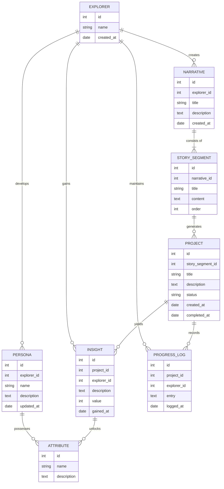

# NarratiAct ER図

## エンティティ説明

1. EXPLORER (探索者): システムの中心的なエンティティで、ユーザーを表します。
2. NARRATIVE (ナラティブ): 探索者の人生の物語を表現します。
3. STORY_SEGMENT (ストーリーセグメント): ナラティブの章や節を表現します。
4. PROJECT (プロジェクト): 具体的な行動や挑戦を表します。
5. INSIGHT (洞察): プロジェクト完了時に得られる経験や気づきを表します。
6. PERSONA (ペルソナ): 探索者の特性や性格を表現します。
7. ATTRIBUTE (資質): 探索者が獲得した能力や特性を表します。
8. PROGRESS_LOG (進捗記録): プロジェクトの進行状況や結果を記録します。
